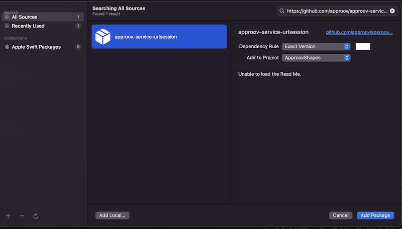

# Approov Quickstart: iOS Swift URLSession

This quickstart is written specifically for native iOS apps that are written in Swift and making API calls using [`URLSession`](https://developer.apple.com/documentation/foundation/urlsession) that you wish to protect with Approov. If this is not your situation then check if there is a more relevant quickstart guide available.

This quickstart provides the basic steps for integrating Approov into your app. A more detailed step-by-step guide using a [Shapes App Example](https://github.com/approov/quickstart-ios-swift-urlsession/blob/master/SHAPES-EXAMPLE.md) is also available.

To follow this guide you should have received an onboarding email for a trial or paid Approov account.

## ADDING APPROOV SERVICE DEPENDENCY
The Approov integration is available via the [`Swift Package Manager`](https://developer.apple.com/documentation/swift_packages/adding_package_dependencies_to_your_app). This allows inclusion into the project by simply specifying a dependency in the `Add Package Dependency` Xcode option:



This package is actually an open source wrapper layer that allows you to easily use Approov with `URLSession`. This has a further dependency to the closed source [Approov SDK](https://github.com/approov/approov-ios-sdk). Please head to the Github repository location at `https://github.com/approov/approov-service-urlsession` and check the available tags in order to select the latest available version, for example `3.0.1` or `3.0.1-bitcode`.

## USING APPROOV SERVICE
The `ApproovURLSession` class mimics the interface of the `URLSession` class provided by Apple but includes an additional ApproovSDK attestation call. The simplest way to use the `ApproovURLSession` class is to find and replace all the `URLSession` with `ApproovURLSession`. 

```swift
try! ApproovService.initialize("<enter-your-config-string-here>")
let session = ApproovURLSession(URLSessionConfiguration.default)
```
Additionally, the Approov SDK wrapper class, `ApproovService` needs to be initialized before ussing the `ApproovURLSession` object. The `<enter-your-config-string-here>` is a custom string that configures your Approov account access. This will have been provided in your Approov onboarding email (it will be something like `#123456#K/XPlLtfcwnWkzv99Wj5VmAxo4CrU267J1KlQyoz8Qo=`).

For API domains that are configured to be protected with an Approov token, this adds the `Approov-Token` header and pins the connection. This may also substitute header values when using secrets protection.

## ERROR TYPES
The `ApproovService` functions may throw specific errors to provide additional information:

* `permanentError` might be due to a feature not enabled using the command line
* `rejectionError` an attestation has been rejected, the `ARC` and `rejectionReasons` may contain specific device information that would help troubleshooting
* `networkingError` generaly can be retried since it can be temporary network issue
* `pinningError` is a certificate error
* `configurationError` a configuration feature is disabled or wrongly configured (i.e. attempting to initialize with different config from a previous instantiation) 
* `initializationFailure` the ApproovService failed to be initialized (subsequent network requests will not be performed)

## CHECKING IT WORKS
Initially you won't have set which API domains to protect, so the interceptor will not add anything. It will have called Approov though and made contact with the Approov cloud service. You will see logging from Approov saying `unknown URL`.

Your Approov onboarding email should contain a link allowing you to access [Live Metrics Graphs](https://approov.io/docs/latest/approov-usage-documentation/#metrics-graphs). After you've run your app with Approov integration you should be able to see the results in the live metrics within a minute or so. At this stage you could even release your app to get details of your app population and the attributes of the devices they are running upon.

## NEXT STEPS
To actually protect your APIs there are some further steps. Approov provides two different options for protection:

* [API PROTECTION](https://github.com/approov/quickstart-ios-swift-urlsession/blob/master/API-PROTECTION.md): You should use this if you control the backend API(s) being protected and are able to modify them to ensure that a valid Approov token is being passed by the app. An [Approov Token](https://approov.io/docs/latest/approov-usage-documentation/#approov-tokens) is short lived crytographically signed JWT proving the authenticity of the call.

* [SECRETS PROTECTION](https://github.com/approov/quickstart-ios-swift-urlsession/blob/master/SECRETS-PROTECTION.md): If you do not control the backend API(s) being protected, and are therefore unable to modify it to check Approov tokens, you can use this approach instead. It allows app secrets, and API keys, to be protected so that they no longer need to be included in the built code and are only made available to passing apps at runtime.

Note that it is possible to use both approaches side-by-side in the same app, in case your app uses a mixture of 1st and 3rd party APIs.
See [REFERENCE](https://github.com/approov/quickstart-ios-swift-urlsession/blob/master/REFERENCE.md) for a complete list of all of the `ApproovService` methods.

## BITCODE SUPPORT
The `ApproovService` swift package provides different versions with and without `bitcode` support. If you would like to support `bitcode` in your application, you should install a version of the `ApproovService` that supports it as well. Head to the Github repository location at `https://github.com/approov/approov-service-urlsession` and check the tags, selecting the latest version of the package that supports bitcode:


In this case, we should use `3.0.1-bitcode` since is the latest bitcode enabled version. 