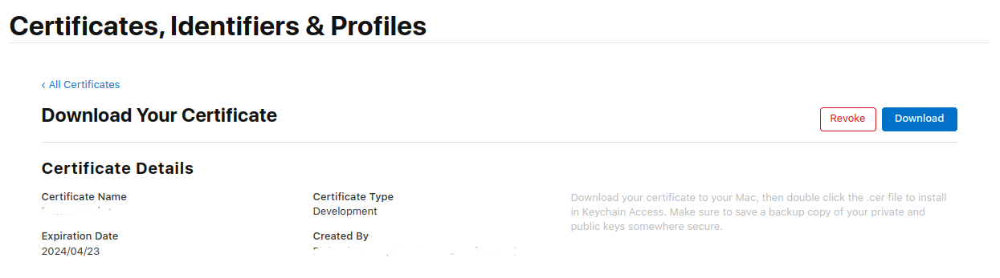

# Secrets Protection
You should use this option if you wish to protect app secrets, including API keys. Rather than build secrets into an app, where they might be reverse engineered, they are only provided at runtime by Approov for apps that pass attestation. This substantially improves your protection and prevents these secrets being abused by attackers.

These additional steps require access to the [Approov CLI](https://approov.io/docs/latest/approov-cli-tool-reference/), please follow the [Installation](https://approov.io/docs/latest/approov-installation/) instructions.

## ADDING API DOMAINS
In order for secrets or API keys to be protected when being transmitted externally by the app, it is necessary to inform Approov about the domains on which they may be sent. Execute the following command:

```
approov api -add your.domain -noApproovToken
```

This informs Approov that it should be active for the domain, but does not need to send Approov tokens for it. Adding the domain uses [Managed Trust Roots](https://approov.io/docs/latest/approov-usage-documentation/#managed-trust-roots) to ensure that the channel will be protected against Man-in-the-Middle (MitM) attacks.

## MIGRATING THE SECRET INTO APPROOV
It is assumed that you already have some client secrets and/or API keys in your app that you would like to migrate for [protection by Approov](https://approov.io/docs/latest/approov-usage-documentation/#secure-strings). You must inform Approov what the value of each secret is as follows:

```
approov secstrings -addKey your-secret-name -predefinedValue your-secret-value
```

> Note that this command requires an [admin role](https://approov.io/docs/latest/approov-usage-documentation/#account-access-roles).

These values can be changed at any time and will propagate within 5 minutes to all running instances of your apps. Since earlier released versions of the app may have already leaked `your-secret-value`, you may wish to refresh the secret at some later point when any older version of the app is no longer in use. You can of course do this update over-the-air using Approov without any need to modify the app.

You can define up to 16 different secret values in this way.

## SUBSTITUTING THE SECRET AUTOMATICALLY
If the secret is presented in an API header or query parameter, and you are able to use the `ApproovService` networking stack, then Approov can automatically substitute the secret value at runtime. You should use this method wherever possible.

If the published code of your app currently uses `your-secret-value` then replace it with the value `your-secret-name`. This provides a placeholder value which can then be automatically substituted with the actual secret value at runtime, for validly attesting apps. The shipped app code will only contain the placeholder values.

If the secret value needs to be provided on the header `your-header` then it is necessary to notify the `ApproovService` that the header is subject to substitution. You do this by making the call once, after initialization:

```swift
ApproovService.addSubstitutionHeader(header: "your-header", prefix: nil)
```

With this in place, network calls using `ApproovURLSession` should replace `your-secret-name` with `your-secret-value` as required when the app passes attestation. Since the mapping lookup is performed on the secret name you have the flexibility of providing different secrets on different API calls, even if they are passed with the same header name.

You can see a [worked example](https://github.com/approov/quickstart-ios-swift-urlsession/blob/master/SHAPES-EXAMPLE.md#shapes-app-with-secrets-protection) for the Shapes app.

If the secret value is provided as a parameter in a URL query string with the name `your-param` then it is necessary to notify the `ApproovService` that the query parameter is subject to substitution. You do this by making the call once, after initialization:

```swift
ApproovService.addSubstitutionQueryParam(key: "your-param")
```

After this the `ApproovURLSession` should transform any instance of a URL such as `https://your.domain/endpoint?your-param=your-secret-name` into `https://your.domain/endpoint?your-param=your-secret-value`.

## OBTAINING THE SECRET EXPLICITLY
In some cases it might not be possible to automatically substitute a secret in a header or query parameter. This might be because the secret is used in other ways in your application.

In this case it is possible to make an explicit call at runtime to obtain the secret value, for apps passing attestation. Here is an example for using the required method in `ApproovService`:

```swift
var secret: String?
do {
    try secret = ApproovService.fetchSecureString(key: "your-secret-name", newDef: nil)
} catch ApproovError.rejectionError(let message, let ARC, let rejectionReasons) {
    // failure due to the attestation being rejected, the ARC and rejectionReasons
    // contain additional information
} catch ApproovError.configurationError(let message) {
    // feature has not been enabled using the command line tools
} catch ApproovError.permanentError(let message) {
    // we are unable to get the secure string due to a more permanent error
} catch ApproovError.networkingError(let message) {
    // we are unable to get the secure string due to network conditions so the request can
    // be retried by the user later
} catch {
    // unexpected error
}
// use secret as required, but never cache or store its value - note secret will be nil
// if the provided secret name is not defined
```

> **IMPORTANT:** The secrets obtained should only ever be communicated externally from the app over channels using the Approov networking stack and which have been added as protected API domains. If not then it is possible for them to be intercepted by a Man-in-the-Middle (MitM) attack.

## HANDLING REJECTIONS
If the app is not recognized as being valid by Approov then an `ApproovError` type exception is thrown from the network request and the API call is not completed. The secret value will never be communicated to the app in this case.

If the exception is of type `ApproovError.rejectionError` it contains an `ARC` value which should provide more information regarding a possible reason for the failure, as explained in [Attestation Response Code](https://approov.io/docs/latest/approov-usage-documentation/#attestation-response-code). It would be possible to provide more information about the status of the device without revealing any details to the user.

If you wish to provide more direct feedback then enable the [Rejection Reasons](https://approov.io/docs/latest/approov-usage-documentation/#rejection-reasons) feature:

```
approov policy -setRejectionReasons on
```

> Note that this command requires an [admin role](https://approov.io/docs/latest/approov-usage-documentation/#account-access-roles).

You will then be able to use the `rejectionReasons` value in the `ApproovError.rejectionError` returned from the network call to obtain a comma separated list of [device properties](https://approov.io/docs/latest/approov-usage-documentation/#device-properties) responsible for causing the rejection.

## ADD YOUR SIGNING CERTIFICATE TO APPROOV
You should add the signing certificate used to sign apps. These are available in your Apple development account portal. Go to the initial screen showing program resources:


Click on `Certificates` and you will be presented with the full list of development and distribution certificates for the account. Click on the certificate being used to sign applications from your particular Xcode installation and you will be presented with the following dialog:



Now click on the `Download` button and a file with a `.cer` extension is downloaded, e.g. `development.cer`. Add it to Approov with:

```
approov appsigncert -add development.cer -autoReg
```

This ensures that any app signed with the certificate will be recognized by Approov.

If it is not possible to download the correct certificate from the portal then it is also possible to [add app signing certificates from the app](https://approov.io/docs/latest/approov-usage-documentation/#adding-apple-app-signing-certificates-from-app).

> **IMPORTANT:** Apps built to run on the iOS simulator are not code signed and thus auto-registration does not work for them. In this case you can consider [forcing a device ID to pass](https://approov.io/docs/latest/approov-usage-documentation/#forcing-a-device-id-to-pass) to get a valid attestation.

## FURTHER OPTIONS
See [Exploring Other Approov Features](https://approov.io/docs/latest/approov-usage-documentation/#exploring-other-approov-features) for information about additional Approov features you may wish to try.

### Development Key
You may wish to [set a development key](https://approov.io/docs/latest/approov-usage-documentation/#using-a-development-key) in order to force an app to be passed, if it may be resigned by a different app signing certificate to which you don't have access. Perform the call:

```swift
ApproovService.setDevKey(devKey: "uDW9FuLVpL1_4zo1")
```

See [using a development key](https://approov.io/docs/latest/approov-usage-documentation/#using-a-development-key) to understand how to obtain the development key which is the parameter to the call.

### Header Prefixes
In some cases the value to be substituted on a header may be prefixed by some fixed string. A common case is the presence of `Bearer` included in an authorization header to indicate the use of a bearer token. In this case you can specify a prefix as follows:

```swift
ApproovService.addSubstitutionHeader(header: "Authorization ", prefix: "Bearer")
```

This causes the `Bearer` prefix to be stripped before doing the lookup for the substitution, and the `Bearer` prefix added to the actual secret value as part of the substitution.

### App Instance Secure Strings
In addition to secret values defined in the Approov cloud, it is also possible to get and set secure string values independently for each app instance. These are never communicated to the Approov cloud service, but are encrypted at rest using keys which can only be retrieved by passing apps. You can use this feature to protect user authorization tokens issued to individual apps or other sensitive customer data, for instance.

App instance secure strings can be set and retrived using the [secret fetching code](#obtaining-the-secret-explicitly). You can define a new value for a given secret name by passing a value in the second parameter of `fetchSecureString`, rather than `nil`. An empty string may be used to delete the secure string completely.

### Prefetching
If you wish to reduce the latency associated with substituting the first secret, then make this call immediately after initializing `ApproovService`:

```swift
ApproovService.prefetch()
```

This initiates the process of fetching the required information as a background task, so that it is available immediately when subsequently needed. Note the information will automatically expire after approximately 5 minutes.

### Prechecking
You may wish to do an early check in your app to present a warning to the user if it is not going to be able to access secrets because it fails the attestation process. Here is an example of calling the appropriate method in `ApproovService`:

```swift
do {
    try ApproovService.precheck()
} catch ApproovError.rejectionError(let message, let ARC, let rejectionReasons) {
    // failure due to the attestation being rejected, the ARC and rejectionReasons
    // objects contain additional information
} catch ApproovError.networkingError(let message) {
    // we are unable to perform a precheck due to network conditions so the request can
    // be retried by the user later
} catch ApproovError.configurationError(let message) {
    // feature has not been enabled using the command line tools
} catch ApproovError.permanentError(let message) {
    // we are unable to perform a precheck due to a more permanent error
} catch {
    // Unexpected error
}
```

> Note you should NEVER use this as the only form of protection in your app, this is simply to provide an early indication of failure to your users as a convenience. You must always also have secrets essential to the operation of your app, or access to backend API services, protected with Approov. This is because, although the Approov attestation itself is heavily secured, it may be possible for an attacker to bypass its result or prevent it being called at all. When the app is dependent on the secrets protected, it is not possible for them to be obtained at all without passing the attestation.
